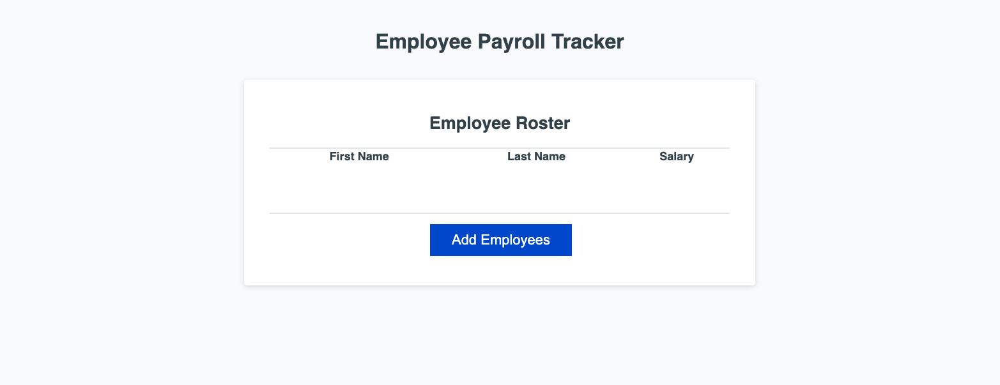

# Employee Payroll Tracker



## Description

The **Employee Payroll Tracker** is a web application designed to help payroll managers efficiently track employee information and calculate payroll metrics. The application allows users to add employees with their first name, last name, and salary, and provides features to display employee data in a sorted table, calculate the average salary, and randomly select an employee.

This project is built with HTML, CSS, and JavaScript and demonstrates dynamic DOM manipulation, data validation, and responsive design principles.

---

## Table of Contents

- [Description](#description)
- [Features](#features)
- [Usage](#usage)
- [Technologies Used](#technologies-used)
- [Installation](#installation)
- [Live Demo](#live-demo)
- [Credits](#credits)
- [License](#license)

---

## Features

- **Add Employees**: Input employee first name, last name, and salary.
- **Validation**:
  - Salary must be a positive number.
  - First name and last name are mandatory.
- **Dynamic Table**: Employee data is displayed in a table, sorted alphabetically by last name.
- **Average Salary**: Calculates and logs the average salary to the console.
- **Random Employee**: Selects and logs a random employee to the console.
- **Responsive Design**: Adapts to various screen sizes for better usability.

---

## Usage

1. Open the application in a browser.
2. Click the "Add Employees" button to input employee details.
3. Follow the prompts to enter the employee's first name, last name, and salary.
   - If invalid data is entered, the app will request the correct input.
4. After adding all employees, view the employee data displayed in the table.
5. Open the browser's console to view the average salary and a randomly selected employee's information.

---

## Technologies Used

- **HTML**: Structure of the application.
- **CSS**: Styling and responsive design.
- **JavaScript**: Logic for dynamic DOM manipulation and data validation.

---

## Installation

1. Clone this repository to your local machine:
   ```bash
   git clone https://github.com/michaelpratt23/employee-payroll-calculator.git
   ```
2. Navigate to the project directory:

   ```bash
   cd employee-payroll-tracker

   ```

3. Open the project in your default browser:

   ```bash
   open index.html
   ```

## Live Demo

Check out the live demo of the project here: [Employee Payroll Tracker](https://michaelpratt23.github.io/employee-payroll-calculator/)​⬤

## Credits

- **Developer**: Michael Pratt
- **GitHub Repository**: [GitHub Link](https://github.com/michaelpratt23/employee-payroll-calculator)
- **Bootcamp Project**: This project was completed as part of the edX Boot Camps curriculum.
- **Starter Code**: Base HTML, CSS, and JavaScript structure provided by the boot camp.

---

## License

This project is licensed under the MIT License. See the LICENSE file for details.
